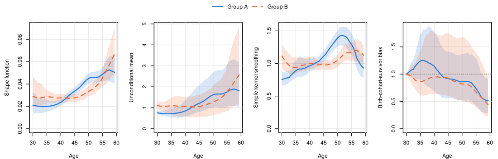

<!-- README.md is generated from README.Rmd. Please edit that file. -->

# TrajChain 

<!-- badges: start -->

[](https://github.com/pingbohu43/TrajChain/actions/workflows/R-CMD-check.yaml)
[-blue.svg)](https://www.gnu.org/licenses/gpl-3.0)
<!-- badges: end -->

**TrajChain** estimates population-level biomarker trajectories from
longitudinal cohort studies in which individuals enter at different ages
and are followed until death or dropout. Two features of such studies
distort naive age curves: deaths during follow-up (biomarkers are only
observed in survivors) and delayed entry (left truncation, which becomes
informative when birth cohorts differ). The package implements the
nonparametric framework of Hu, Wu, Zhao and Sun, in which a latent
variable $Z^0$ that may be associated with both death and birth cohort
multiplies a common **shape function** $f(t)$:

$$E\{Y^0(t) \mid Z^0, T^0 = s\} = Z^0 f(t), \qquad t \le s.$$

Under conditional independence assumptions on study entry and dropout,
the selection effects cancel in the ratio $f(t)/f(t - v)$, which is
therefore identified from consecutive measurements; `TrajChain`
estimates these ratios by kernel smoothing and recovers $f$ over the
whole age range by **ratio chaining**, without modeling survival,
truncation or dropout. It then estimates the unconditional mean
trajectory and quantifies the combined **birth-cohort-survivor bias**.

## Features

- Shape function by ratio chaining for equally spaced visits, and by
  penalized ratio matching for widely or unequally spaced visit
  schedules.
- Unconditional mean trajectory, birth-cohort-survivor bias and naive
  Nadaraya–Watson curve, with two estimators of the latent mean
  (baseline-only or pooled visits) for different assumptions on dropout.
- Data-driven tuning: cross-validation for the bandwidth constant and
  for the penalty.
- Subject-level bootstrap standard errors and pointwise confidence
  bands, with optional parallel computation.
- Graphics for one or several groups, and simulators for the main
  simulation designs of the paper (random or informative truncation,
  equally or unequally spaced visits) together with their true curves.
- Verified against the original research code that produced the results
  in the paper: the regression tests reproduce its estimators,
  cross-validation, bootstrap and data generators to numerical
  precision.

## Installation

Install the development version from GitHub:

``` r
# install.packages("remotes")
remotes::install_github("pingbohu43/TrajChain", build_vignettes = TRUE)
```

## Example

`simcohort` is a simulated cohort with a baseline visit and two
follow-up visits every 16 months, deaths, dropout and informative
delayed entry. We estimate the trajectories on ages 30–59.33 ($m = 22$
grid points) for each group and compare them, with 95% bootstrap bands:

``` r
library(TrajChain)

fit_group <- function(g) {
  d <- subset(simcohort, group == g)
  Y <- visit_matrix(d, id = "id", visit = "visit", value = "marker")
  A <- d$entry_age[match(rownames(Y), d$id)]
  trajchain(Y, A, visit_gaps = 16 / 12, tau0 = 30, m = 22)
}
fitA <- fit_group("A")
fitA
#> <TrajChain fit>
#>   Shape estimator : ratio chaining (Section 3)
#>   Mean estimator  : baseline measurements (equation 5)
#>   Subjects        : 300, with 762 measurements (2.54 per subject)
#>   Visit gaps      : 1.333, equally spaced (2 follow-up visits)
#>   Age interval    : [30, 59.33], m = 22 grid points (step 1.333)
#>   Bandwidths      : h = 2.832 (ratio), h' = 5.48 (mean)
#> 
#>    age   shape   mean   bias     nw
#>  30.00 0.02102 0.7559 1.0000 0.7559
#>  35.87 0.02016 0.7250 1.2547 0.9097
#>  41.73 0.02693 0.9685 1.0310 0.9985
#>  47.60 0.03929 1.4130 0.8901 1.2578
#>  53.47 0.04632 1.6659 0.8329 1.3874
#>  59.33 0.05049 1.8157 0.5123 0.9301

bootA <- trajchain_boot(fitA, B = 200, seed = 1)
bootB <- trajchain_boot(fit_group("B"), B = 200, seed = 2)
plot_trajectories(list("Group A" = bootA, "Group B" = bootB))
```

<!-- -->

The naive kernel smoother of the observed markers (third panel) bends
down at older ages because survivors to older ages are a selected group;
the shape function and the unconditional mean remove this selection, and
the fourth panel quantifies it.

## Main functions

| Function                           | Purpose                                                                   |
|------------------------------------|---------------------------------------------------------------------------|
| `trajchain()`                      | Fit the shape function, unconditional mean and birth-cohort-survivor bias |
| `cv_bandwidth()`, `cv_lambda()`    | Cross-validation for the bandwidth constant and the penalty               |
| `trajchain_boot()`                 | Subject-level bootstrap standard errors and confidence bands              |
| `plot_trajectories()`              | Plot one or several fits, with bootstrap bands                            |
| `ratio_estimate()`                 | Kernel estimator of $f(t)/f(t - v)$                                       |
| `visit_matrix()`                   | Long-format data to a subject-by-visit matrix                             |
| `simulate_cohort()`, `sim_truth()` | Simulation designs of the paper and their true curves                     |

See `vignette("TrajChain")` for a worked analysis and
`vignette("simulation")` for the simulation designs, unequally spaced
visits and tuning.

## Citation

If you use TrajChain, please cite the paper (see
`citation("TrajChain")`):

> Hu, P., Wu, Y., Zhao, Y. and Sun, Y. Nonparametric estimation of
> marker trajectories in the presence of death and delayed entry.
> Manuscript under revision at *Biometrika*.

## License

GPL (\>= 3)
