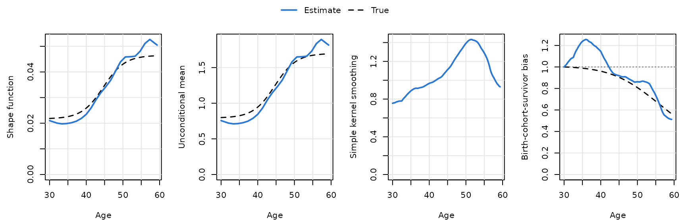
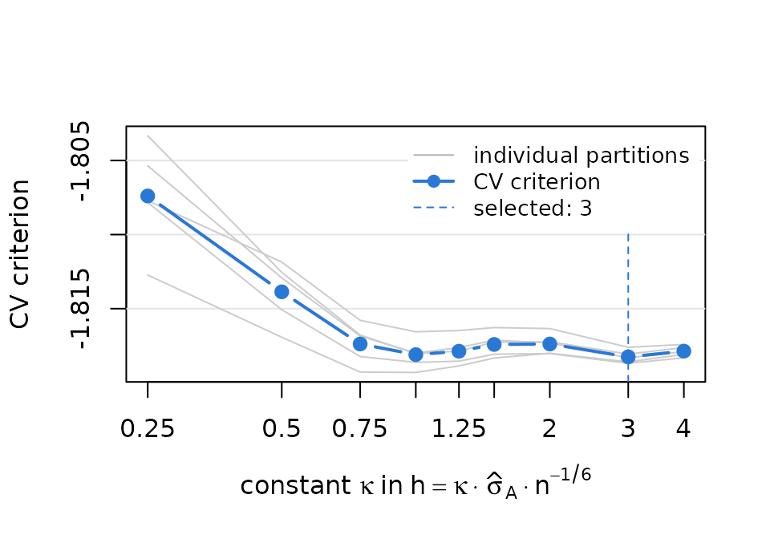
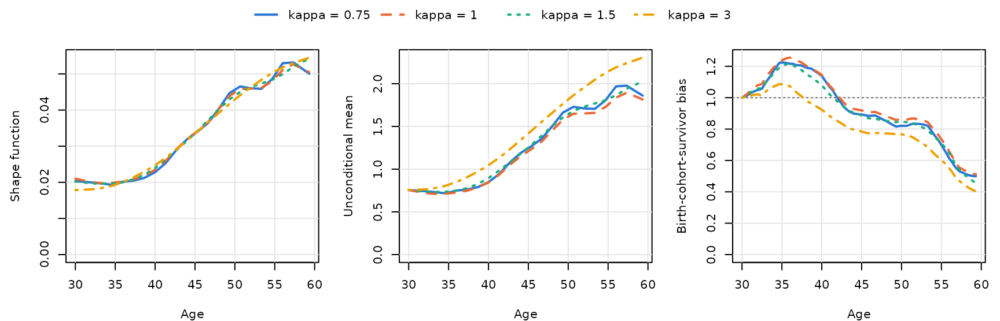
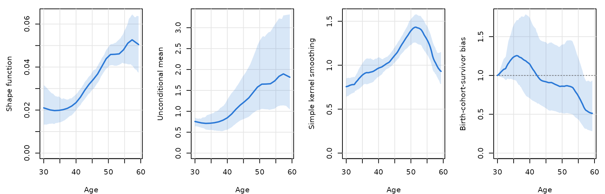
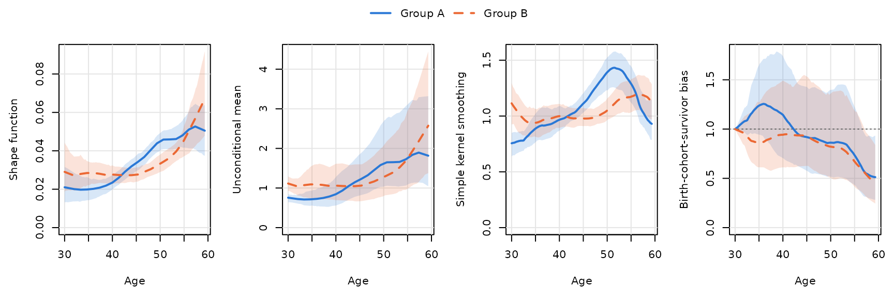
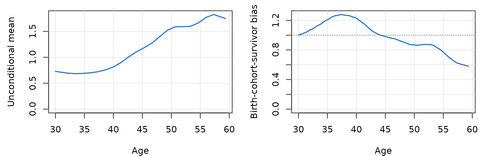

# Getting started with TrajChain

`TrajChain` estimates population-level biomarker trajectories from
longitudinal cohort studies in which individuals enter at different ages
and are followed until death or dropout. It implements the nonparametric
framework of Hu, Wu, Zhao and Sun (*Nonparametric estimation of marker
trajectories in the presence of death and delayed entry*, manuscript
under revision at *Biometrika*). This vignette explains the estimands
and walks through a complete analysis of a simulated cohort.

``` r

library(TrajChain)
```

## Why naive age curves are biased

A common way to summarize how a biomarker changes with age is to smooth
the observed measurements against age. In a cohort that enrolls a
cross-sectional sample and follows it over time, such a curve mixes
three things:

- the **age-related change** that every individual undergoes;
- **survivor bias**: at older ages only survivors are observed, and if
  death is associated with the biomarker through unobserved factors,
  survivors are a selected group;
- **birth-cohort effects**: individuals observed at older ages were born
  earlier. Delayed entry (left truncation) means that the cohorts are
  sampled differently at each age, so differences between birth cohorts
  leak into the age curve.

## Model and estimands

Let \tau_0 be the starting age of the trajectory (age 30 in the ABC-DS
application of the paper); the target population consists of individuals
alive at \tau_0. For such an individual let Y^0(t) be the marker at age
t, T^0 the age at death and Z^0\>0 an unobserved latent variable. The
model is

E\\Y^0(t) \mid Z^0, T^0 = s\\ = Z^0 f(t), \qquad \tau_0 \le t \le s,

with \int\_{\tau_0}^{\tau_1} f(t)\\dt = 1. The **shape function** f is
the common age-related pattern; Z^0 captures individual heterogeneity
and may be associated with survival, with the age at study entry (birth
cohort) and with dropout, in ways that are left unspecified. Neither
survival times nor the reason for dropout need to be observed. Two
conditional independence assumptions are needed:

- **(A1)** the age at entry A^0 is independent of the marker process
  given Z^0 and the age at death, so birth cohorts may differ only
  through Z^0;
- **(A2)** the dropout index C (the last follow-up visit before loss to
  follow-up for reasons other than death) is independent of the age at
  death and the marker process given the entry age and Z.

Dropout that depends on the marker values themselves (for example,
sicker participants leaving the study) violates (A2).

For individuals entering the study at age t (alive at entry), the mean
of the observed marker is

E\\Y(A) \mid A = t\\ = \mu\_{Z^0}(t)\\ f(t), \qquad \mu\_{Z^0}(t) =
E(Z^0 \mid A^0 = t, T^0 \ge t),

so a naive Nadaraya–Watson curve estimates the shape distorted by
\mu\_{Z^0}(t). `TrajChain` reports

| Quantity | Formula | Column in `fit$curves` |
|----|----|----|
| Shape function | f(t) | `shape` |
| Unconditional mean | \mu\_{Z^0}(\tau_0)\\ f(t) | `mean_*` |
| Birth-cohort-survivor bias | \mu\_{Z^0}(t)/\mu\_{Z^0}(\tau_0) | `bias_*` |
| Latent mean among survivors | \mu\_{Z^0}(t) | `mu_*` |
| Simple kernel smoothing | E\\Y(A) \mid A = t\\ (baseline) or all visits (pooled) | `nw_*` |

The unconditional mean is the mean trajectory in the absence of death;
with birth-cohort effects it refers to the subgroup whose starting age
coincides with the study baseline. The bias curve equals one at \tau_0;
values below one mean that survivors entering at age t have a lower
latent level than the reference group, i.e. lower marker levels than the
reference group would have at the same age.

**How f is identified.** For two ages v apart, under (A1)–(A2) the
nuisance factors cancel in the ratio of means of consecutive
measurements, so r(t, t-v) = f(t)/f(t-v) is estimated by a kernel ratio
estimator
([`ratio_estimate()`](https://pingbohu43.github.io/TrajChain/reference/ratio_estimate.md)).
With equally spaced visits these ratios are chained along the grid u_j =
\tau_0 + (j - 0.5)v and normalized to integrate to one (*ratio
chaining*). With widely or unequally spaced visits,
[`trajchain()`](https://pingbohu43.github.io/TrajChain/reference/trajchain.md)
matches all estimable ratios by penalized least squares.

## The data

`simcohort` is a simulated cohort in long format (one row per
measurement): 600 subjects in two groups, a baseline visit and up to two
follow-up visits every 16 months, with deaths, dropout and informative
delayed entry.

``` r

head(simcohort)
#>   id group visit     age entry_age  marker
#> 1  1     A     0 37.1463   37.1463 0.53748
#> 2  1     A     1 38.4796   37.1463 0.68528
#> 3  1     A     2 39.8129   37.1463 0.88437
#> 4  2     A     0 47.7841   47.7841 1.19542
#> 5  2     A     1 49.1174   47.7841 1.00355
#> 6  3     A     0 56.0942   56.0942 0.90858
table(simcohort$group, simcohort$visit)
#>    
#>       0   1   2
#>   A 300 270 192
#>   B 300 263 177
```

[`trajchain()`](https://pingbohu43.github.io/TrajChain/reference/trajchain.md)
needs a subject-by-visit matrix (`NA` for visits that did not take
place), the entry ages and the scheduled time between visits.
[`visit_matrix()`](https://pingbohu43.github.io/TrajChain/reference/visit_matrix.md)
builds the matrix from long data:

``` r

dA <- subset(simcohort, group == "A")
YA <- visit_matrix(dA, id = "id", visit = "visit", value = "marker")
AA <- dA$entry_age[match(rownames(YA), dA$id)]
head(YA, 4)
#>   visit_0 visit_1 visit_2
#> 1 0.53748 0.68528 0.88437
#> 2 1.19542 1.00355      NA
#> 3 0.90858 0.92835 0.82075
#> 4 0.81164 0.93762      NA
```

Visits are scheduled every 16 months, so the grid step is v = 16/12
years. We study ages 30 to 59.33, i.e. m = 22 grid points, as in the
paper’s analysis.

## Fitting the model

``` r

fitA <- trajchain(YA, AA, visit_gaps = 16 / 12, tau0 = 30, m = 22)
fitA
#> <TrajChain fit>
#>   Shape estimator : ratio chaining (Section 3)
#>   Mean estimator  : baseline measurements (equation 5)
#>   Subjects        : 300, with 762 measurements (2.54 per subject)
#>   Visit gaps      : 1.333, equally spaced (2 follow-up visits)
#>   Age interval    : [30, 59.33], m = 22 grid points (step 1.333)
#>   Bandwidths      : h = 2.832 (ratio), h' = 5.48 (mean)
#> 
#>    age   shape   mean   bias     nw
#>  30.00 0.02102 0.7559 1.0000 0.7559
#>  35.87 0.02016 0.7250 1.2547 0.9097
#>  41.73 0.02693 0.9685 1.0310 0.9985
#>  47.60 0.03929 1.4130 0.8901 1.2578
#>  53.47 0.04632 1.6659 0.8329 1.3874
#>  59.33 0.05049 1.8157 0.5123 0.9301
```

The defaults follow the paper: ratio bandwidth h = \hat\sigma_A
n^{-1/6}, mean bandwidth h' = 2.34\\\hat\sigma_A n^{-1/5}, Epanechnikov
kernel, and the baseline-measurement estimator of \mu\_{Z^0}(t), which
remains valid in the presence of birth-cohort effects. Because
`simcohort` is simulated, we can add the true curves (dashed) to the
plot:

``` r

tau <- 22 * 16 / 12
truth_age <- function(shape) {
  s <- seq(0, 1, length.out = 201)
  tr <- sim_truth(s, shape = shape, truncation = "informative")
  data.frame(t = 30 + tau * s, shape = tr$shape / tau, mean = tr$mean, bias = tr$bias)
}
plot(fitA, truth = truth_age("monotone"))
```



The simple kernel smoothing curve (third panel) rises until about age 52
and then declines, although the underlying shape keeps increasing:
survivors at older ages have lower latent levels, which is what the
decreasing birth-cohort-survivor bias (fourth panel) quantifies. The
estimated shape and unconditional mean recover the increasing trend. The
estimated bias shows a bump in the thirties that the true curve does not
have; the bootstrap bands below show that this part of the curve is
estimated with considerable uncertainty. The bias and the unconditional
mean are anchored at age 30, and few subjects enter the study close to
that age.

Estimates at particular ages are available from
[`summary()`](https://rdrr.io/r/base/summary.html) and
[`predict()`](https://rdrr.io/r/stats/predict.html):

``` r

summary(fitA, ages = c(30, 40, 50, 59))$table
#>   age      shape      mean      bias        nw
#> 1  30 0.02101682 0.7558515 1.0000000 0.7558515
#> 2  40 0.02347536 0.8442709 1.1445659 0.9663231
#> 3  50 0.04488544 1.6142655 0.8620525 1.3915815
#> 4  59 0.05085148 1.8288290 0.5143551 0.9406675
predict(fitA, c(35, 45, 55), type = "mean")
#> [1] 0.717112 1.210540 1.754381
```

## Bandwidth: rule of thumb and cross-validation

The constant \kappa in h = \kappa\\\hat\sigma_A n^{-1/6} can be chosen
by five-fold cross-validation with
[`cv_bandwidth()`](https://pingbohu43.github.io/TrajChain/reference/cv_bandwidth.md).
Its criterion compares, in held-out subjects, consecutive measurements
with the ratio predicted from the training subjects. With small samples,
averaging over several random partitions (`n_repeats`) reduces partition
noise.

``` r

cvA <- cv_bandwidth(YA, AA, visit_gaps = 16 / 12, tau0 = 30, m = 22, n_repeats = 5)
cvA
#> <TrajChain cross-validation: bandwidth constant>
#>   5-fold CV over subjects, 5 partition(s), fold-specific training-fold scale
#>   selected constant 3, i.e. h = 3 * sd(A) * n^(-1/6) = 8.497
#> 
#>  constant     cv bandwidth n_dropped
#>      0.25 -1.807    0.7081       0.4
#>      0.50 -1.814    1.4162       0.0
#>      0.75 -1.817    2.1243       0.0
#>      1.00 -1.818    2.8324       0.0
#>      1.25 -1.818    3.5405       0.0
#>      1.50 -1.817    4.2486       0.0
#>      2.00 -1.817    5.6647       0.0
#>      3.00 -1.818    8.4971       0.0
#>      4.00 -1.818   11.3295       0.0
plot(cvA)
```



Here the criterion is very flat for \kappa \ge 1: the data hardly
discriminate between these bandwidths. A useful practice, as in the
paper, is to report the rule-of-thumb fit (\kappa = 1) and check the
sensitivity of the conclusions to \kappa:

``` r

fits_kappa <- lapply(c(0.75, 1, 1.5, cvA$constant), function(k) {
  trajchain(YA, AA, 16 / 12, tau0 = 30, m = 22, bandwidth = k * bw_rot(AA))
})
names(fits_kappa) <- paste("kappa =", c(0.75, 1, 1.5, cvA$constant))
plot_trajectories(fits_kappa, which = c("shape", "mean", "bias"))
```



The shape function is stable across bandwidths. The unconditional mean
and the bias curve are anchored at the starting age through
\hat\mu\_{Z^0}(\tau_0), which divides the kernel smoother at \tau_0 by
\hat f(\tau_0), a value extrapolated from the first grid points; they
are therefore more sensitive to the bandwidth, as observed in the data
analysis of the paper.

## Bootstrap confidence bands

[`trajchain_boot()`](https://pingbohu43.github.io/TrajChain/reference/trajchain_boot.md)
resamples subjects with replacement and refits with the bandwidths held
fixed, giving pointwise standard errors and percentile confidence bands
for every curve.

``` r

bootA <- trajchain_boot(fitA, B = 200, seed = 2026)
summary(bootA, ages = c(35, 45, 55), which = c("shape", "bias"))
#>   quantity age   estimate          se      lower      upper
#> 1    shape  35 0.01993965 0.002981290 0.01430354 0.02593062
#> 2    shape  45 0.03365964 0.001987395 0.02948446 0.03759251
#> 3    shape  55 0.04878143 0.003826776 0.04161207 0.05711464
#> 4     bias  35 1.23741262 0.193820175 0.94419394 1.64774933
#> 5     bias  45 0.91850415 0.223049734 0.57693722 1.42748648
#> 6     bias  55 0.73491325 0.228378379 0.43286323 1.22625737
plot(bootA)
```



The bias curve is fixed at one at age 30 by construction, so its band
has zero width there. This reflects the normalization rather than
precise estimation at age 30: the uncertainty about \hat\mu\_{Z^0}(30)
shows up in the width of the bias band at later ages and in the band of
the unconditional mean.

## Comparing groups

Analyses stratified by a grouping variable (sex in the paper) are run
separately and displayed together with
[`plot_trajectories()`](https://pingbohu43.github.io/TrajChain/reference/plot_trajectories.md):

``` r

fit_group <- function(g) {
  d <- subset(simcohort, group == g)
  Y <- visit_matrix(d, id = "id", visit = "visit", value = "marker")
  A <- d$entry_age[match(rownames(Y), d$id)]
  trajchain(Y, A, visit_gaps = 16 / 12, tau0 = 30, m = 22)
}
bootB <- trajchain_boot(fit_group("B"), B = 200, seed = 2027)
plot_trajectories(list("Group A" = bootA, "Group B" = bootB))
```



## Which estimator of the mean?

Both estimators of \mu\_{Z^0}(t) are computed in every fit:

- `mu_method = "baseline"` (equation 5 of the paper) smooths the
  baseline measurements only. It is valid under assumptions (A1)–(A2),
  which allow the entry age, death and dropout to depend on the latent
  variable, and therefore allows birth-cohort effects. This is the
  default and was used for the ABC-DS analysis.
- `mu_method = "pooled"` (equation 6) pools all observed visits. It
  requires dropout to be independent of (T, Y, Z) given the entry age
  (assumption A2’) and approximates \mu\_{Z^0}(t) when the visit gaps
  are small; with birth-cohort effects and wider gaps it mixes subjects
  who entered at different ages. It was used in the simulation studies
  of the paper, where there is no birth-cohort effect.

``` r

head(fitA$curves[, c("t", "bias_baseline", "bias_pooled")], 3)
#>          t bias_baseline bias_pooled
#> 1 30.00000      1.000000    1.000000
#> 2 30.03667      1.001197    1.001007
#> 3 30.07333      1.002389    1.002007
plot(fitA, which = c("mean", "bias"), mu_method = "pooled")
```



## Practical notes

- **Scheduled visit times.** Visit l of subject i is placed at A_i +
  v_1 + \dots + v_l, the scheduled time. Small deviations of the actual
  visit dates are ignored, as in the paper.
- **Monotone dropout.** The method assumes that a subject is observed at
  visits 0, 1, \dots, C and not afterwards. If a visit is missing but a
  later one is observed,
  [`trajchain()`](https://pingbohu43.github.io/TrajChain/reference/trajchain.md)
  warns and uses only pairs of consecutive observed visits.
- **Undefined ratios.** If some grid age has no pair of consecutive
  visits within one bandwidth, the ratio estimator is undefined there.
  The chain estimator then stops with an informative error (increase the
  bandwidth or narrow \[\tau_0, \tau_1\]); the penalized estimator drops
  such ratios.
- **Choice of \tau_0.** The unconditional mean and the bias curve are
  anchored at \tau_0, so \tau_0 should lie well within the range of
  entry ages;
  [`trajchain()`](https://pingbohu43.github.io/TrajChain/reference/trajchain.md)
  warns when fewer than 10 subjects enter within one bandwidth h' of
  \tau_0.
- **Unequally or widely spaced visits.** Give the vector of gaps in
  `visit_gaps` (or a finer `grid_step`);
  [`trajchain()`](https://pingbohu43.github.io/TrajChain/reference/trajchain.md)
  then uses the penalized estimator and chooses the penalty by
  cross-validation. See
  [`vignette("simulation", package = "TrajChain")`](https://pingbohu43.github.io/TrajChain/articles/simulation.md).

## Reference

Hu, P., Wu, Y., Zhao, Y. and Sun, Y. Nonparametric estimation of marker
trajectories in the presence of death and delayed entry. Manuscript
under revision at *Biometrika*.
