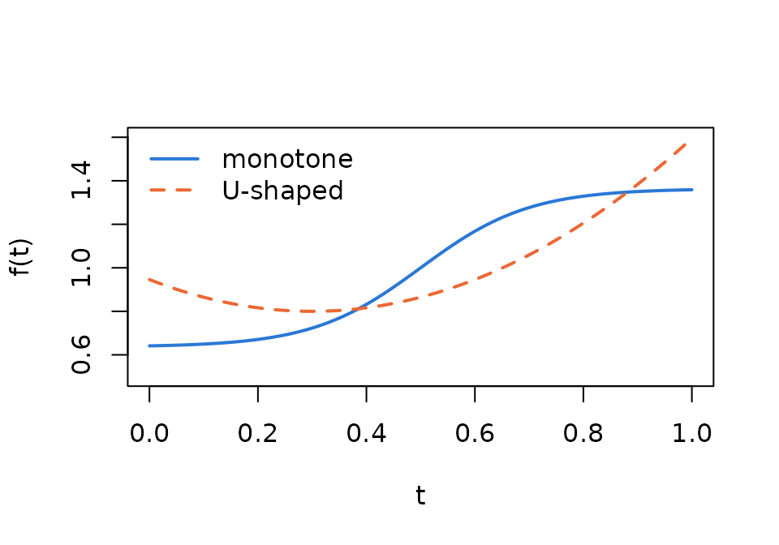
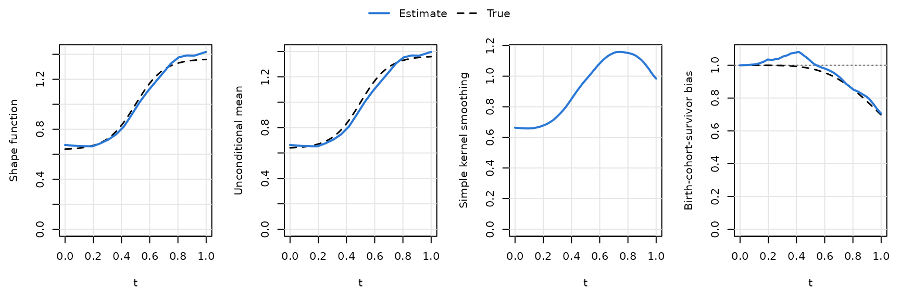
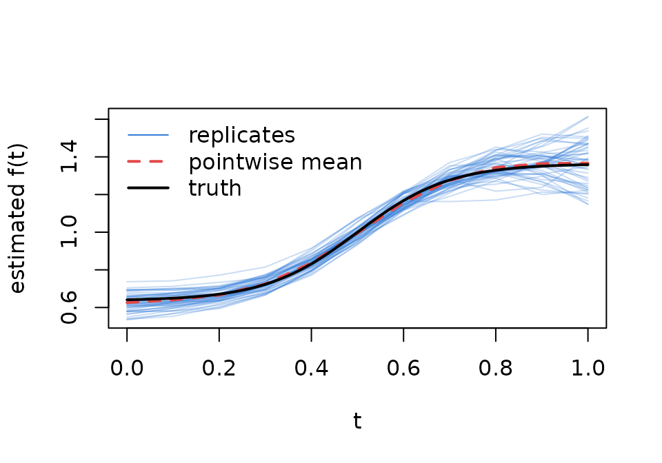
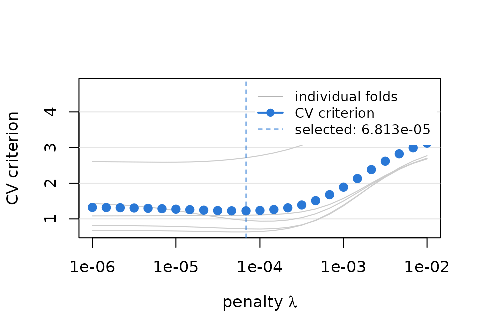
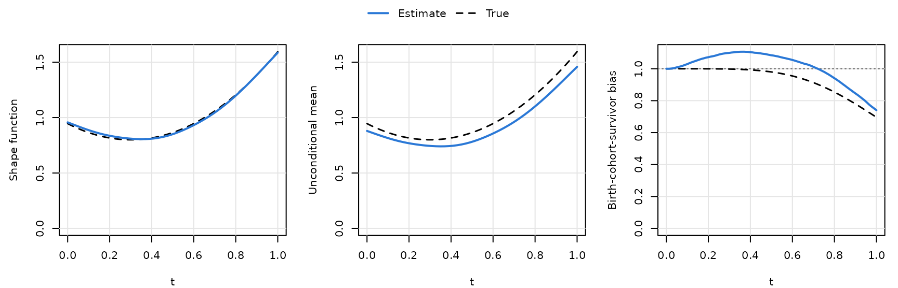
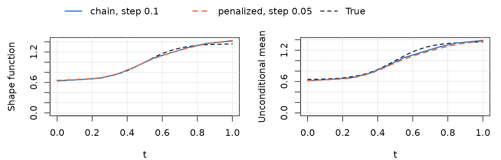
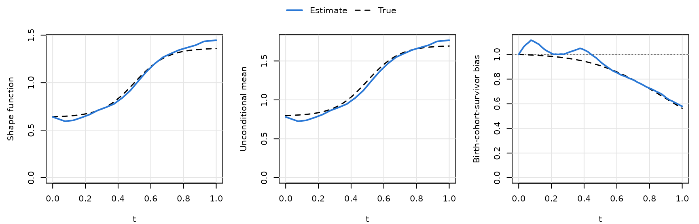

# Simulation designs, unequal visit spacing and tuning

This vignette reproduces, on a small scale, the simulation designs of
Section 6 of Hu, Wu, Zhao and Sun, and shows how `TrajChain` handles
unequally and widely spaced visits. See
[`vignette("TrajChain")`](https://pingbohu43.github.io/TrajChain/articles/TrajChain.md)
for an introduction to the model and the estimands.

``` r

library(TrajChain)
```

## The simulation designs

[`simulate_cohort()`](https://pingbohu43.github.io/TrajChain/reference/simulate_cohort.md)
generates data on the unit age scale \[0, 1\]. In the underlying
population the latent variable Z^0 is log-normal with mean 1 and
variance 0.25, the age at death given Z^0 = z is Weibull with shape 4.7
and scale 0.85 z^{-1/4.7} (so that individuals with larger Z^0 die
earlier), and the marker is Y^0(t) = Z^0 f(t) e_t with log-normal noise
of mean 1 and variance 0.05. Two shape functions are available:

``` r

curve(shape_monotone(x), 0, 1, ylim = c(0.5, 1.6), lwd = 2, col = "#2a78d6",
      xlab = "t", ylab = "f(t)")
curve(shape_ushape(x), 0, 1, add = TRUE, lwd = 2, lty = 2, col = "#eb6834")
legend("topleft", c("monotone", "U-shaped"), lty = 1:2, lwd = 2,
       col = c("#2a78d6", "#eb6834"), bty = "n")
```



Entry ages follow either *random truncation*, A^0 \sim U(-0.3, 1.9)
independent of Z^0 (no birth-cohort effect), or *informative
truncation*, where A^0 + 0.3 given Z^0 = z is Weibull with shape 3.2 and
scale 1.2 z^{-1/3.2} (a birth-cohort effect). Only individuals alive at
entry are enrolled (about half of the population). Each subject has a
baseline visit and up to five follow-up visits, either equally spaced
with gap 1/\lfloor 6 n^{0.16}\rfloor or unequally spaced with gaps
(0.10, 0.10, 0.12, 0.10, 0.12); follow-up stops at death or dropout.

``` r

sim <- simulate_cohort(n = 1000, shape = "monotone", seed = 1)
sim
#> <TrajChain simulated cohort>
#>   n = 1000 subjects enrolled (50.8% of the 10000 simulated individuals were alive at entry)
#>   truncation: random; visits: 0.05556, equally spaced (5 follow-up visits)
#>   mean number of observed measurements per subject: 2.91
#>   pass Y, entry_age and visit_gaps to trajchain() with tau0 = 0 and tau1 = 1
```

[`sim_truth()`](https://pingbohu43.github.io/TrajChain/reference/sim_truth.md)
computes the true curves by numerical integration. Under random
truncation, \mu\_{Z^0}(t) = E(Z^0 \mid T^0 \ge t) is the pure survivor
bias and \mu\_{Z^0}(0) = 1:

``` r

sim_truth(c(0, 0.25, 0.5, 0.75, 1))
#>      t     shape        mu      bias      mean
#> 1 0.00 0.6412312 1.0000000 1.0000000 0.6412312
#> 2 0.25 0.6915332 0.9992067 0.9992067 0.6915332
#> 3 0.50 1.0000000 0.9800188 0.9800188 1.0000000
#> 4 0.75 1.3084668 0.8857202 0.8857202 1.3084668
#> 5 1.00 1.3587688 0.6962223 0.6962223 1.3587688
```

## Equally spaced visits

There is no birth-cohort effect and dropout is unrelated to the latent
variable, so assumption (A2’) holds and the pooled estimator of
\mu\_{Z^0}(t) (equation 6) can be used, as in the paper.

``` r

fit <- trajchain(sim$Y, sim$entry_age, sim$visit_gaps, tau0 = 0, tau1 = 1,
                 mu_method = "pooled")
plot(fit, truth = sim_truth(fit$curves$t), xlab = "t")
```



### A small Monte Carlo study

The following loop repeats the analysis for 50 data sets and summarizes
the pointwise bias and standard deviation of \hat f at t = 0, 0.1,
\dots, 1, as in the supplementary tables of the paper (which use 1000
replicates).

``` r

R <- 50
ages <- seq(0, 1, by = 0.1)
est <- t(vapply(seq_len(R), function(r) {
  s <- simulate_cohort(n = 1000, shape = "monotone", seed = r)
  f <- trajchain(s$Y, s$entry_age, s$visit_gaps, tau0 = 0, tau1 = 1,
                 mu_method = "pooled", n_grid = 101)
  predict(f, ages, type = "shape")
}, numeric(length(ages))))
round(rbind(bias = colMeans(est) - shape_monotone(ages),
            sd = apply(est, 2, sd)), 3)
#>        [,1]   [,2]   [,3]  [,4]  [,5]   [,6]   [,7]   [,8]  [,9] [,10] [,11]
#> bias -0.015 -0.010 -0.005 0.002 0.005 -0.005 -0.010 -0.003 0.014 0.014 0.008
#> sd    0.047  0.041  0.036 0.033 0.034  0.035  0.035  0.042 0.059 0.077 0.125
```

``` r

matplot(ages, t(est), type = "l", lty = 1, col = grDevices::adjustcolor("#2a78d6", 0.25),
        xlab = "t", ylab = "estimated f(t)")
lines(ages, colMeans(est), lwd = 2, lty = 2, col = "#e34948")
curve(shape_monotone(x), 0, 1, add = TRUE, lwd = 2)
legend("topleft", c("replicates", "pointwise mean", "truth"), bty = "n",
       col = c("#2a78d6", "#e34948", "black"), lty = c(1, 2, 1), lwd = c(1, 2, 2))
```



## Unequally spaced visits

With gaps (5, 5, 6, 5, 6) \times 0.02, ratios are directly estimable
only for ages 0.10 or 0.12 apart.
[`trajchain()`](https://pingbohu43.github.io/TrajChain/reference/trajchain.md)
takes the greatest common divisor of the gaps, 0.02, as the grid step (m
= 50), estimates every ratio \hat r(u_j, u\_{j'}) with u_j - u\_{j'} \in
\\0.10, 0.12\\, and combines them by penalized weighted least squares
(Section 5 of the paper). Ratios based on fewer than c^\* = 0.6\\n h
observations receive zero weight.

The penalty \lambda is chosen by five-fold cross-validation over the
grid used in the paper (25 values from 10^{-6} to 10^{-2}):

``` r

sim3 <- simulate_cohort(n = 1000, shape = "ushape", visit_gaps = "unequal", seed = 3)
cvl <- cv_lambda(sim3$Y, sim3$entry_age, sim3$visit_gaps, tau0 = 0, tau1 = 1)
cvl$lambda
#> [1] 6.812921e-05
plot(cvl)
```



``` r

fit3 <- trajchain(sim3$Y, sim3$entry_age, sim3$visit_gaps, tau0 = 0, tau1 = 1,
                  lambda = cvl, mu_method = "pooled")
fit3
#> <TrajChain fit>
#>   Shape estimator : penalized ratio matching (Section 5), lambda = 6.81e-05, constraint = "anchor"
#>   Mean estimator  : all observed visits (equation 6)
#>   Subjects        : 1000, with 2823 measurements (2.82 per subject)
#>   Visit gaps      : 0.1, 0.1, 0.12, 0.1, 0.12 (5 follow-up visits)
#>   Age interval    : [0, 1], m = 50 grid points (step 0.02)
#>   Bandwidths      : h = 0.1133 (ratio), h' = 0.2106 (mean)
#> 
#>  age  shape   mean   bias     nw
#>  0.0 0.9571 0.8797 1.0000 0.8797
#>  0.2 0.8361 0.7686 1.0725 0.8243
#>  0.4 0.8098 0.7444 1.1034 0.8214
#>  0.6 0.9320 0.8567 1.0551 0.9039
#>  0.8 1.1980 1.1012 0.9408 1.0360
#>  1.0 1.5865 1.4583 0.7407 1.0802
head(fit3$pairs)
#>   age_from age_to gap     ratio   n kept     weight
#> 1     0.01   0.11 0.1 0.9234061 345 TRUE 0.02399666
#> 2     0.03   0.13 0.1 0.9231099 332 TRUE 0.02309244
#> 3     0.05   0.15 0.1 0.9273819 337 TRUE 0.02344022
#> 4     0.07   0.17 0.1 0.9327579 344 TRUE 0.02392711
#> 5     0.09   0.19 0.1 0.9396088 352 TRUE 0.02448355
#> 6     0.11   0.21 0.1 0.9474545 353 TRUE 0.02455311
plot(fit3, which = c("shape", "mean", "bias"),
     truth = sim_truth(fit3$curves$t, shape = "ushape"), xlab = "t")
```



`trajchain(..., lambda = "cv")` (the default for the penalized
estimator) runs the same cross-validation internally.

The penalized problem is normalized so that the estimate integrates to
one. By default (`constraint = "anchor"`) it is solved in closed form
with the first grid value fixed and then rescaled, which is the
implementation used for the results in the paper.
`constraint = "integral"` instead solves the quadratic program with the
integral and non-negativity constraints:

``` r

fit3q <- trajchain(sim3$Y, sim3$entry_age, sim3$visit_gaps, tau0 = 0, tau1 = 1,
                   lambda = cvl$lambda, constraint = "integral", mu_method = "pooled")
max(abs(fit3q$curves$shape - fit3$curves$shape))
#> [1] 0.03908067
```

## Widely spaced visits

When visits are far apart, a grid with the visit gap as its step is
coarse. Section 5 of the paper refines the grid to step v/q; the ratios
then define q interleaved chains, which the penalty links together. In
[`trajchain()`](https://pingbohu43.github.io/TrajChain/reference/trajchain.md)
this only requires `grid_step`:

``` r

simw <- simulate_cohort(n = 1000, visit_gaps = rep(0.1, 5), seed = 4)
fit_coarse <- trajchain(simw$Y, simw$entry_age, simw$visit_gaps, tau0 = 0, tau1 = 1,
                        mu_method = "pooled")
fit_fine <- trajchain(simw$Y, simw$entry_age, simw$visit_gaps, tau0 = 0, tau1 = 1,
                      grid_step = 0.05, mu_method = "pooled")
c(coarse = fit_coarse$design$m, fine = fit_fine$design$m)
#> coarse   fine 
#>     10     20
plot_trajectories(list("chain, step 0.1" = fit_coarse, "penalized, step 0.05" = fit_fine),
                  which = c("shape", "mean"), truth = sim_truth(seq(0, 1, by = 0.01)),
                  xlab = "t")
```



## Informative truncation

With informative truncation, the entry age depends on Z^0 and
\mu\_{Z^0}(t) = E(Z^0 \mid A^0 = t, T^0 \ge t) combines survivor and
birth-cohort selection. The baseline estimator (equation 5), the
default, remains valid:

``` r

simi <- simulate_cohort(n = 2000, truncation = "informative", seed = 5)
fiti <- trajchain(simi$Y, simi$entry_age, simi$visit_gaps, tau0 = 0, tau1 = 1)
plot(fiti, which = c("shape", "mean", "bias"),
     truth = sim_truth(fiti$curves$t, truncation = "informative"), xlab = "t")
```



## Running the full simulation study

The paper uses 1000 replicates for each design and sample size. The code
below (not run here) parallelizes over replicates and stores the curves
on the dense grid; since every replicate re-creates its data from its
seed, no objects need to be exported to the workers.

``` r

library(parallel)
one_replicate <- function(seed, n) {
  s <- simulate_cohort(n = n, shape = "monotone", seed = seed)
  f <- trajchain(s$Y, s$entry_age, s$visit_gaps, tau0 = 0, tau1 = 1, mu_method = "pooled")
  f$curves[, c("shape", "mean_pooled", "bias_pooled")]
}
res <- mclapply(1:1000, one_replicate, n = 1000, mc.cores = detectCores() - 1)
shape_mat <- t(vapply(res, function(r) r$shape, numeric(801)))
```
